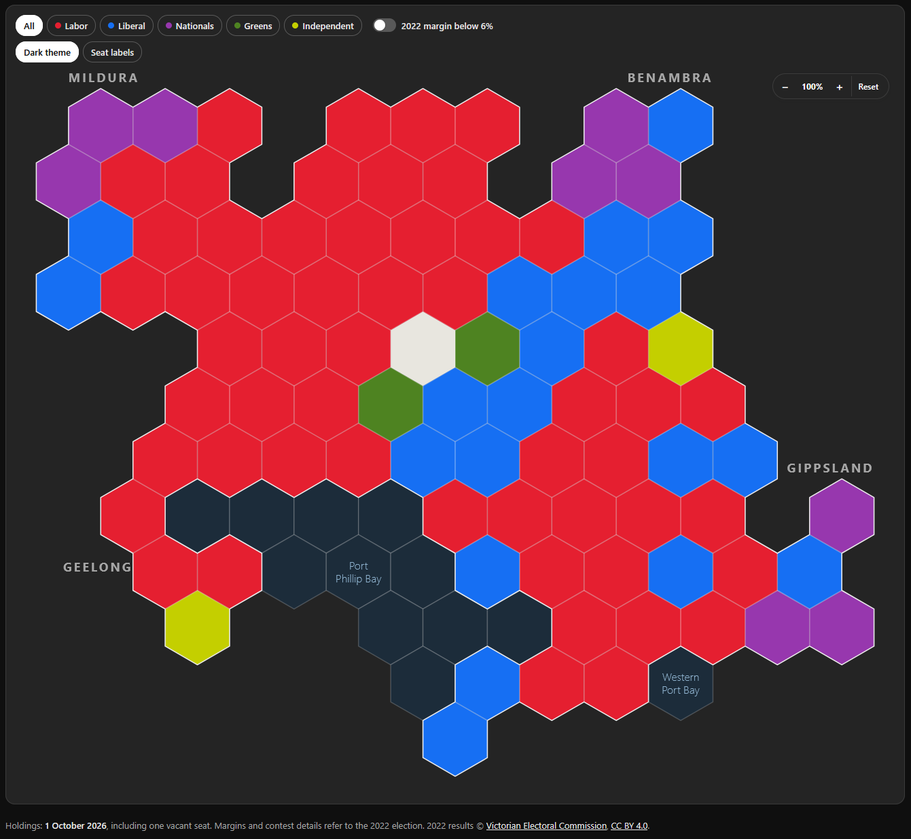

# Victorian Hexagon Map

A hexagon map of the 88 seats in Victoria's Legislative Assembly, built as a React component you can copy into your own project. Every seat is one hexagon of the same size, placed roughly where the seat sits in the state and coloured by the party that holds it.

Each seat counts the same in Parliament, but on a geographic map the Melbourne seats, where most of them are, shrink to specks beside the country ones. Giving every seat the same space shows the house as it votes.

## What is in it

- **The map.** A self-contained React component. Point at or select a seat, filter by party, zoom and pan, and switch between light and dark themes. Its only dependency is React.
- **The data.** The 2022 election result for every seat (winner, runner-up and margin), checked against Victorian Electoral Commission counts. It also holds the state of the house on 1 October 2026: Labor 54, Liberal 20, Nationals 9, Greens 2, Independent 2 and one vacancy, with each change since the election linked to its source.
- **A demo page.** Its map and controls are in the screenshot above.
- **Tests.** Checks on the data, the map's rules, its markup and its security.

## Try it

The demo is live at https://14pete99.github.io/victorian-hex-map/.

To run it yourself, you need Node 20.19+, 22.12+ or 24+.

```bash
git clone https://github.com/14pete99/victorian-hex-map.git
cd victorian-hex-map
npm install
npm run dev
```

Then open http://127.0.0.1:5183.

## Use the map in your project

Copy the `src/map/` folder and the `LICENSE` file into your project. You need React 19 and a bundler that handles CSS imports, such as Vite. Then render it:

```tsx
import { useState } from 'react';
import { ASSEMBLY_SEATS, HexMap } from './map';

const filters = { party: null, atRisk: false };

export function SeatMap() {
  const [hovered, setHovered] = useState<string | null>(null);
  const [selected, setSelected] = useState<string | null>(null);
  return <HexMap seats={ASSEMBLY_SEATS} filters={filters} hovered={hovered} selected={selected} onHover={setHovered} onSelect={setSelected} assembly />;
}
```

To show a result of your own, name the seats that change hands. Every other seat keeps its 2022 result, and the changed ones are drawn as gains:

```tsx
import { projectSeats } from './map';

const seats = projectSeats({ Bass: 'LIB', Northcote: 'GRN' });
```

[Using the map](docs/using-the-map.md) covers every prop, theming, sizing and the things that commonly go wrong.

## Where the data comes from

The 2022 winners, runners-up and margins are the Victorian Electoral Commission's. All 88 were compared with its published counts on 7 October 2026, and a test fails if the data drifts from them. The changes since the election come from the VEC and the Parliament of Victoria, and each is linked in the demo.

This is not an official record. [Data and sources](docs/data.md) explains how each figure is worked out and how to correct one.

## Good to know

- **It is an early release.** At version 0.1, props, exports, class names and `data-` attributes may still change.
- **The snapshot is dated.** It records the house on 1 October 2026 and does not update itself.
- **Seats are not yet keyboard accessible.** The filter and zoom controls work from the keyboard; the hexagons need a pointer.

## Documentation

- [Using the map](docs/using-the-map.md): props, results, colours, sizing and pitfalls.
- [Data and sources](docs/data.md): what is recorded, where it comes from and how it was checked.
- [Developing](docs/development.md): project layout, tests, security checks and releases.
- [AGENTS.md](AGENTS.md): the same ground for AI coding agents.

## Contributing

Issues and pull requests are welcome, and [CONTRIBUTING.md](CONTRIBUTING.md) explains how to make one. A correction to a seat's result needs a link to the VEC page it comes from.

To report a security problem, follow the [security policy](SECURITY.md) instead of opening an issue.

## Licence

The code, map layout and documentation are under the [MIT licence](LICENSE).

The 2022 election results are © Victorian Electoral Commission, used under the [Creative Commons Attribution 4.0 International licence](https://creativecommons.org/licenses/by/4.0/). If you pass the data on, keep that credit with it. [Data and sources](docs/data.md#licence-and-attribution) has the detail.
